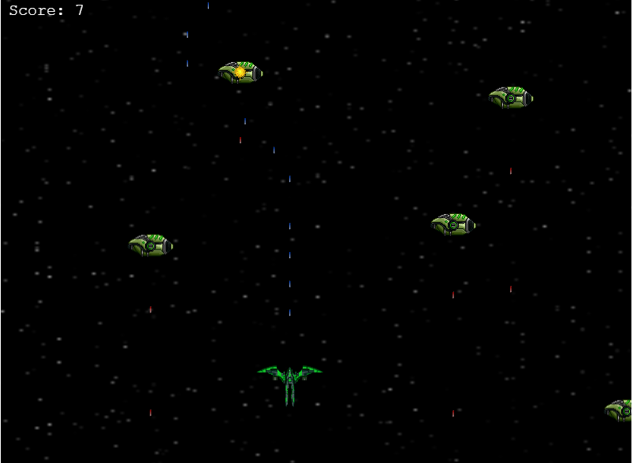

# Project: JS-Capstone-Shoooter

> El Galactico is a Top-Down Space [Shooter Game](https://en.m.wikipedia.org/wiki/Shooter_game), where the player's space ship aims to destroy enemies' space craft thereby accumulating point while avoiding being hit by the enemy.



## How To Play

> Here's how to play El-Galactico

- Use the ```Left```, ```Right```, ```Up```, and ```Down``` arrow ```keys``` to navigate around the scree and dodge enemies' lasers
- Use the ```SPACE KEY``` to shoot lasers
- Any laser aim at the enemy's space craft destroys the target and scores you a point
- Happy playing!


## Live demo

🔗 [Play El Galactico](https://goofy-newton-ffbf77.netlify.app/)

## Built With

- Phaser 3
- Javascript (ES6)
- HTML / CSS
- Webpack
- Jtest

## Run El Galactico Locally

To get a local copy up and running follow these simple steps.

### Prerequisites

In order for ```JS-Capstone-Shoooter``` to work locally on your machine, you need these installations:
- Nodejs and npm
- Web Browser that ```<canvas></canvas>``` supports 

### Install

1) Open the Terminal
2) Run

```sh
git clone https://github.com/belsman/JS-Capstone-Shoooter.git
```

or, for SSH:

```sh
git clone git@github.com:belsman/JS-Capstone-Shoooter.git
```

3) Run ```cd JS-Capstone-Shoooter``` to enter the main directory
4) Run ```npm install```
5) Run ```npm run dev```
6) Visit `http://localhost:8080` in your browser to play
7) Happy playing
`

## Testing

1) Open the Terminal
2) Run ```cd JS-Capstone-Shoooter``` to enter the main directory
3) Run ```npm test```

## Author

👤 **Bello Babakolo**

- Github: [@belsman](https://github.com/belsman)
- Twitter: [@d_belsman](https://twitter.com/d_belsman)
- Linkdin: [Bello Babakolo](https://www.linkedin.com/in/bello-babakolo-b23b17145/)


## 🤝 Contributing

Contributions, issues and feature requests are welcome!

Feel free to check the [issues page](issues/).

## Show your support

Give a ⭐️ if you like this project!

## Acknowledgments

- Microverse for showing the way for this project to happen
- Credit wubitog and Skorpio ( http://opengameart.org/users/skorpio )
- [CraftPix.net](https://opengameart.org/users/craftpixnet-2d-game-assets) 2D Game Assets
- [Create a videogame template](https://phasertutorials.com/creating-a-phaser-3-template-part-1/)
- [The space shooter game tutorial](https://learn.yorkcs.com/category/tutorials/gamedev/phaser-3/build-a-space-shooter-with-phaser-3/)
